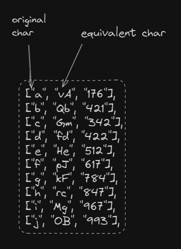
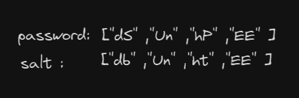
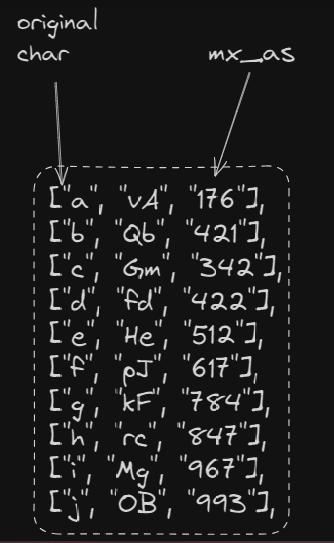
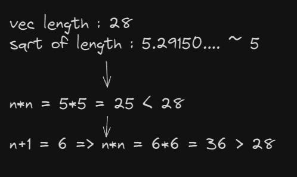
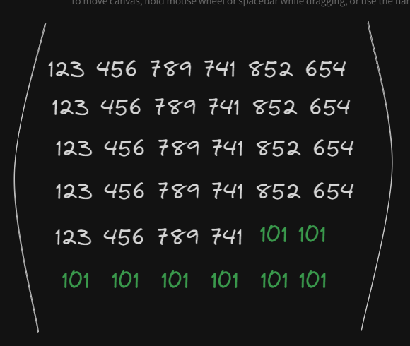
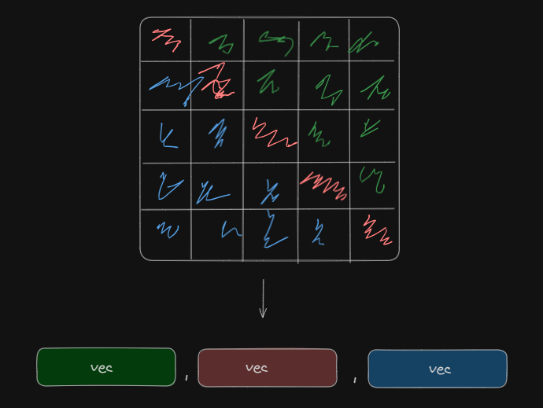

# df1t-cyph

Just a stupid rust based encryption algorithm made without following the cryptography standards.
the name literally stands for **tf is this cypher!**

**Note: this project is made for experimenting purposes and it's highly discouraged to consider it as a serious encryption solution**

## How this thing works?

Like every other encrytion algorithm, it takes a string and a 16 char max salt as an arguments.

this is the beta version of df1t-cyph which has some limitaions:

- the accuracy isn't tested yet which mean you may get inconsistant results.
- the df1t-encrypt accepts only the alphabetical *upper and lower case* letters and fixed numbers only.

## Encryption

the ``df1t-encrypt`` function goes through 6 stages to generate the final result:

- input parsing
- first level mapping
- mixing and switching
- mathematical transformation
- data swapping *second level mapping*
- result arrangement

### input parsing

in this stage, the function will try to parse the passed arguments into a consistant vectors with the same lengths.

#### arg extending

First, both arguments lengths will get compared and the shortest will get extended by itself until it fulfills the longer argument length.

E.g. let's take ``"superpassword"`` as a password and ``"somesalt"`` as a salt. obviously the salt is shorter by 5 chars. after extending it, it should look like this : ``"somesaltsomes"``.

if both args are equal in length this step get skipped.

#### vec transformation

simply, both args will get splitted into vectors


### First level mapping

here the function will run an iteration process on an internal lib that has arrays which represents each char with its mapped equivalent and returns it in a new vector.



the same thing will be applied on the salt vector but with diffrent equivalent char to gain a unique mapping.

### Mixing and switching

After getting the mapped version of both salt and password which somehow should look like this:



a switching function will take both as args and mixed them based on the following criteria:

- if the first chars of the elements *salt and password* wasn't equal, the salt char will be taken.
- if the second chars of the elements wasn't equal, the password char will be taken.
- if both chars was equal, flip them
- if two chars was equal the second couple wasn't ignore them.

here's the visual explanation:


### Mathematical transformation

#### numerical transformation

in this level, the mixed vector elements will get splitted to get a single char element vector
e.g.

```
["d","S","n","U","n","P","E","E"]
```

thus, another iteration will run over the previous lib to get the equivalent mx_as number.



the iteration results should look like this:

```
[145, 654, 879, 147, 963, 123, 412]
```

#### matrixial representaion

here, the function turns the vector into a n*n matrix.
First, it calculates the n of the matrix by finding the sqrt of the last vector then checks if n x n actually equals the vector length, if not then it adds 1 to n.



following this path leads to get extra empty elements since it only have 28 elements to fulfill a 36 matrix. thus, the empty elements will get filled by **101**



#### vectorial transformation

the matrix get splitted by three main vectors following this representaion:



after that, the matrix length will get added to each element of the three vectors

### Data swapping (second level mapping)

while we used a fixed ref in the first mapping level, now we gonna make it a bit dynamic with the use of ceaser substitution over a set of ~ 70 diffrent chars as a refrence.

the ceaser swapping goes as follows:

- move to right by **the green vector length + 2** for the green vector
- move to right by  **the red vector length** for the red vector
- move to right by **the blue vector length + red vector length + 1** for the blue vector

finally, each vector will get joined to a string.

### Result arrangement

The function will concatenate the results in one single string. **the original length of the password + green vec + red vec + blue vec**

- the original length of the password go through the same process of ceaser swapping with moving by **142**. however,the length will be needed for the decryption stage.

for concatination, the function will add **$** between each elements to make it parsable for the decrytion.
